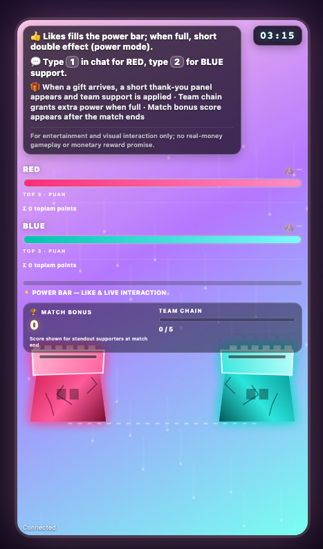

# Live Tower Battle

Interactive stream game where viewers affect a real-time **Red vs Blue tower battle** through TikTok Live events.

## What This Project Does

- Runs a live match with two teams (`red` and `blue`) and tower HP.
- Converts TikTok interactions into game actions:
  - gifts -> damage/support events
  - likes -> power bar progress and temporary boost mode
  - chat (`1`, `2`, `red`, `blue`) -> team pick and soldier spawn
  - joins/view events -> welcome and audience effects
- Streams all gameplay updates to connected browsers with `Socket.IO`.
- Stores daily damage leaderboard data in `data/leaderboard.json`.

## Features

- Real-time game state broadcasting with `Socket.IO`
- Team damage, combo chains, crits, and sudden-death mode
- Power mode triggered by engagement
- Daily leaderboard and per-match team contribution panels
- Streamer/admin panel with manual controls

## Tech Stack

- Node.js (>= 18)
- Express
- Socket.IO
- [tiktok-live-connector](https://www.npmjs.com/package/tiktok-live-connector)
- Vanilla HTML/CSS/JavaScript frontend

## Project Structure

- `server.js` - backend game engine, TikTok integration, API routes, Socket.IO server
- `public/index.html` - main game page
- `public/game.js` - client renderer, animations, socket listeners
- `public/style.css` - game and HUD styling
- `public/admin.html` - admin control interface
- `data/leaderboard.json` - daily leaderboard storage

## Environment Variables

- `PORT` (default: `3000`)
- `TIKTOK_USERNAME` (default: `stream_account`)
- `TIKTOK_ROOM_ID` (optional)
- `ADMIN_TOKEN` (default fallback in code: `admindev`)

Example:

```bash
PORT=3000 TIKTOK_USERNAME=your_live_account ADMIN_TOKEN=replace_me npm start
```

## Local Setup

```bash
npm install
npm start
```

Open in browser:

- Game: `http://localhost:3000`
- Admin: `http://localhost:3000/admin`

## HTTP Endpoints

- `GET /` -> game UI
- `GET /admin` -> admin panel UI
- `GET /api/leaderboard` -> top daily damage entries
- `POST /admin/api` -> admin actions (requires token)

## Admin API

Authentication:

- `Authorization: Bearer <ADMIN_TOKEN>` header, or
- JSON field `token`

Actions (`POST /admin/api`):

- `extendMatch` (payload: `ms`)
- `spawnBot` (payload: `team`, `name`)
- `powerMode` (payload: `ms`)
- `suddenDeath` (no extra payload required)

Example:

```bash
curl -X POST http://localhost:3000/admin/api \
  -H "Content-Type: application/json" \
  -H "Authorization: Bearer your_token" \
  -d '{"action":"extendMatch","ms":60000}'
```

## Socket Events

Server emits (selected):

- `init`, `state`, `gameReset`, `gameOver`
- `giftStrike`, `likeBurst`, `powerMode`
- `viewerJoin`, `viewerJoinEffect`, `viewerCount`
- `spiker`, `bonusPoolWin`, `suddenDeath`, `soldier`, `tiktokStatus`

## Screenshot



## Public Release Checklist

- Set a strong `ADMIN_TOKEN` in environment variables.
- Set a valid `TIKTOK_USERNAME` or `TIKTOK_ROOM_ID`.
- Keep `data/leaderboard.json` writable by the server process.
- Do not commit private credentials or `.env` files.

## License

No license file is included yet. Add a `LICENSE` file before public distribution if needed.
